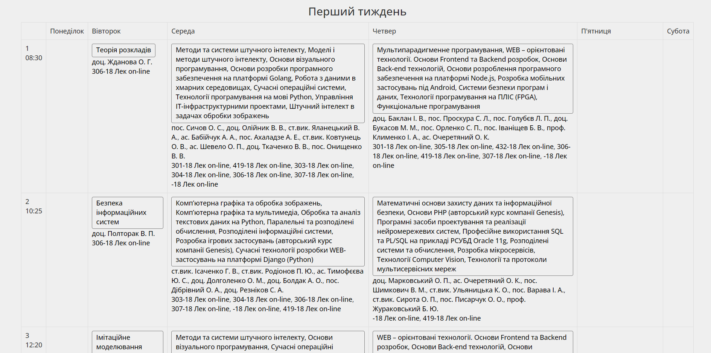
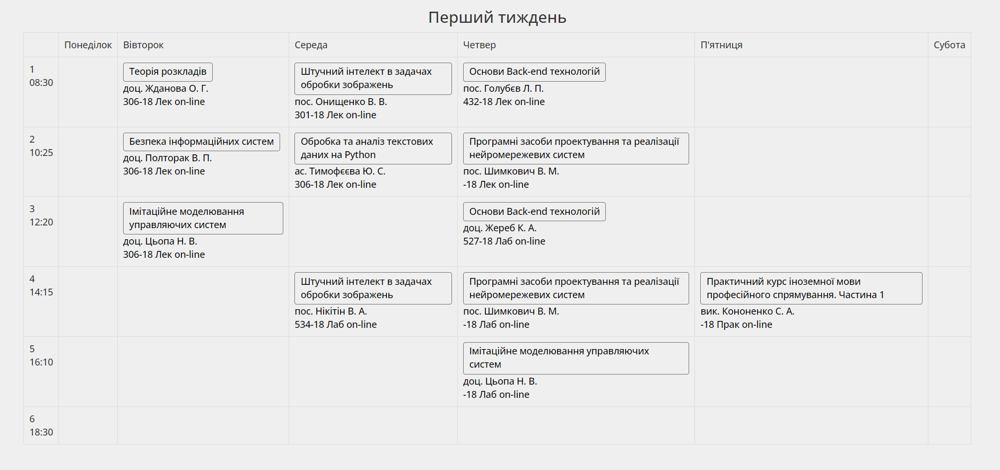

# KPI Schedule Enhancer

Це розширення допоможе привести розклад КПІ в порядок. Воно прибирає зайві вибіркові дисципліни зі сторінки та залишає лише ті, які обрано в його налаштуваннях.

Його можна використовувати на [roz.kpi.ua](http://roz.kpi.ua/) та [epi.kpi.ua](http://epi.kpi.ua/).

## Демонстрація

Зазвичай, розклад містить величезні блоки з купою вибіркових дисциплін. Використання розкладу в такому вигляді є вкрай незручним, адже він займає дуже багато місця на екрані та доводиться витрачати велику кількість часу, аби знайти потрібну дисциліну серед безлічі зайвих.

Як можна побачити на скріншоті, на екран ноутбука поміщається лише 2 перших пари:



Якщо ж використати розширення та приховати всю зайву інформацію, то увесь розклад спокійно вміщається на екрані, внаслідок чого більше немає потреби аналізувати громіздкі текстові блоки в пошуках цінної інформації:



## Встановлення

> **Note**
> Розширення працює лише для Chromium-based браузерів.

Для інсталяції розширення потрібно виконати декілька простих кроків згідно з інструкцією нижче.

1. **Клонуйте або завантажте репозиторій**: 

    В першу чергу потрібно зберегти файли локально, аби пізніше додати їх до бразуера, для цього є 2 варіанти, оберіть той, який вам зручніше.

   - **Клонувати**: Якщо у вас встановлено Git, ви можете клонувати репозиторій за допомогою наступної команди:
     ```
     git clone https://github.com/Nikolaichukr/KPI-Schedule-Enhancer.git
     ```

   - **Завантажити**: Або ж можна натиснути на зелену кнопку "Code" на сторінці репозиторію і вибрати опцію "Download ZIP". Після чого треба розпакувати завантажений ZIP-архів в зручне місце.

2. **Відкрийте Налаштування розширень Chrome**: У Chrome перейдіть до меню браузера (три крапки вгорі праворуч) і виберіть "Розширення" > "Керувати розширеннями". Або ж можна ввести `chrome://extensions/` в адресному рядку.

3. **Увімкніть режим розробника**: У верхньому правому куті сторінки керування розширеннями настисніть на перемикач "Режим розробника", аби увімкнути його.

4. **Завантажте розширення**: Натисніть кнопку "Завантажити розпаковане розширення", яка з'явиться в лівому верхньому кутку після увімкнення режиму розробника. Відкриється діалогове вікно файлового браузера.

5. **Виберіть каталог розширення**: Перейдіть до каталогу, куди ви клонували або розпакували дані з репозиторію, і виберіть папку source_code.

6. **Переконайтесь, що розширення встановлено**: Після вибору папки Chrome завантажить розширення, і ви побачите його в списку встановлених розширень. Переконайтеся, що його перемикач встановлено в позицію "Увімкнено".

Все готово! Ви успішно встановили KPI Schedule Enhancer. Тепер можна перейти на сторінку з розкладом і спробувати його використати.

## Використання

Демонстрація роботи зображена на відео нижче.

https://github.com/Nikolaichukr/KPI-Schedule-Enhancer/assets/51542378/4c2f89c0-f2b9-48f5-9e0b-f25c96ac94b6

## Дисклеймер

Це розширення в першу чергу було створено для покращення мого особистого процесу взаємодії з розкладом, і я просто вирішив викласти його в публічний доступ, на випадок якщо у когось є подібна потреба. Тому прошу звернути увагу на наступне:

- **Обмежене тестування**: Я не проводив серйозного тестування. На момент публікації, розширення працює добре для певних сценарії використаннях, які я передбачив, тим не менш, цілком можливо те, що існують сценарії, які я міг не врахувати.

- **Можливі баги**: В першу чергу, баги можуть з'явитись через обмежене тестування. По-друге, я досить рідко пишу на JavaScript, тому міг не врахувати якихось особливостей мови.

Якщо ж ви зіткнулися з будь-якими проблемами або маєте пропозиції щодо покращення розширення, будь ласка, надсилайте їх через GitHub Issues. Але я не гарантую, що буду займатись подальшою підтримкою.
